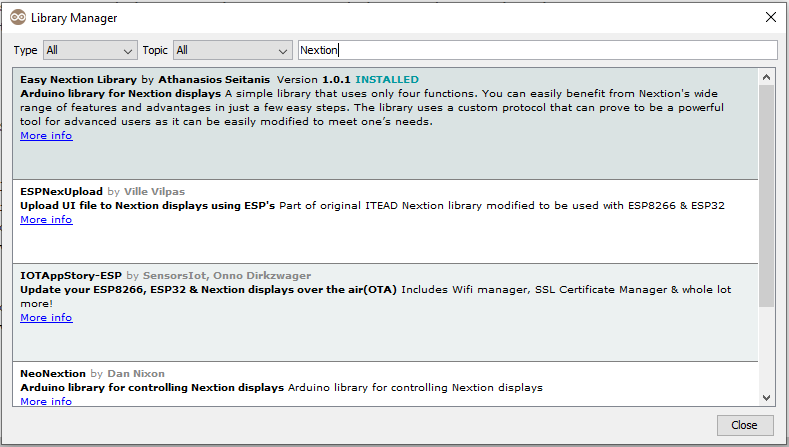
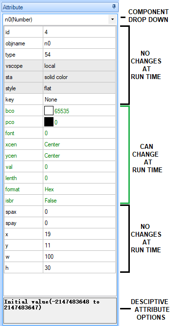




# Easy Nextion Library

## Description

A simple library that uses only four functions. You can easily benefit from Nextion's wide range of features and advantages in just a few easy steps. 
The library uses a custom protocol that can prove to be a **powerful tool** for advanced users as it can be **easily modified** to meet one’s needs.
This is an attempt to give a very simple method to use Nextion monitors for beginners at programming and at the same time to be a strong and reliable method that can be capable of satisfying the needs of the advance programming.
The handling of Nextion should be as simple and at the same time as professional as a display of this kind deserves.

I have invested time and resources providing open source codes, like this one. Please do not hesitate to support my work!
If you found this work useful and has saved you time and effort, 
just simply paypal me at this Link: [seithagta@gmail.com](https://paypal.me/seithan?locale.x=el_GR)

You can find more examples, tutorials and projects with Nextion on my website [seithan.com](https://www.seithan.com/) or at my YouTube channel [Thanasis Seitanis](https://www.youtube.com/channel/UCk_AjYtvzUC58ups5Lm053g)

## Installation 

### First Method
1.  In the Arduino IDE, navigate to Sketch > Include Library > Manage Libraries
1.  Then the Library Manager will open and you will find a list of libraries that are already installed or ready for installation.
1.  Then search for EasyNextionLibrary using the search bar.
1.  Click on the text area and then select the latest version and install it.



### Second Method
1. Download the latest release of EasyNextionLibrary.
- From: [https://github.com/Seithan/EasyNextionLibrary](https://github.com/Seithan/EasyNextionLibrary)
2. Extract the `.zip` file 
3. Copy the EasyNextionLibrary folder, to: ....\Arduino\libraries\  


***NOTE***: `.HMI` files for Nextion Editor are also included in every example's folder.
All `.HMIs` are set for 2.8" Basic screens, so as to be easier to modify it for bigger screens.

## The main functions
- `begin();`
- `writeNum();`
- `writeStr();`
- `readNumber();`
- `trigger();`
 
***And the public variables:***
* currentPageId (Data Type: **Integer**)
* lastCurrentPageId (Data Type: **Integer**)

### Details, examples and explanation on custom protocol, can be found on my website at: 
#### [https://www.seithan.com/EasyNextionLibrary/CustomProtocol/](https://www.seithan.com/EasyNextionLibrary/CustomProtocol/)

## 4-step Example
1.  **Include** ***EasyNextionLibrary*** and create an object of `EasyNex` class
````Cpp
#include "EasyNextionLibrary.h"  // Include EasyNextionLibrary

EasyNex myNex(Serial); // Create an object of EasyNex class with the name < myNex > 
                       // Set as parameter the Serial you are going to use
````
2.  **Begin the object** and give the desired baud rate as a parameter. Also, initialize the built-in LED as output
````Cpp
void setup(){
  myNex.begin(9600); // Begin the object with a baud rate of 9600
                     // If no parameter was given in the begin(), the default baud rate of 9600 will be used 
  pinMode(LED_BUILTIN, OUTPUT); // The built-in LED is initialized as an output                     
}
````
3. **Place** the **NextionListen()** function in the loop.
````Cpp
void loop(){
  myNex.NextionListen(); // This function must be called repeatedly to response touch events
                         // from Nextion touch panel. Actually, you should place it in your loop function.
}
````
4. **Select one of the 50 predefined trigger()** functions and use it as a simple void function (nothing returned).
Declare the void function by simply writing:
````Cpp
void trigger1(){
[ put your code here !!!!]
}
````
* Write the code you want to run in there.  
The `trigger1()` function will run every time the following sequence of bytes (in HEX format) `23 02 54 01` comes to Arduino's Serial. To do that, write in the `Touch Release Event` of the button b0, this command: `printh 23 02 54 01`
````Cpp
void trigger1(){

  digitalWrite(LED_BUILTIN, !digitalRead(LED_BUILTIN)); 
  if(digitalRead(LED_BUILTIN) == HIGH){
    myNex.writeNum("b0.bco", 2016); // Set button b0 background color to GREEN (color code: 2016)
    myNex.writeStr("b0.txt", "ON"); // Set button b0 text to "ON"
    
  }else if(digitalRead(LED_BUILTIN) == LOW){
    myNex.writeNum("b0.bco", 63488); // Set button b0 background color to RED (color code: 63488)
    myNex.writeStr("b0.txt", "OFF"); // Set button b0 text to "ON"
  }
}
````
Enjoy the Easy Nextion Library!! Please do not forget the LED on :)

## Full Example Code
````Cpp
/*
 * FourStepExample.ino - Simple example code
 * Copyright (c) 2020 Athanasios Seitanis < seithagta@gmail.com >. 
 * All rights reserved. EasyNextionLibrary is licensed under the MIT License
 * https://opensource.org/licenses/MIT
 */
#include "EasyNextionLibrary.h"  // Include EasyNextionLibrary

EasyNex myNex(Serial); // Create an object of EasyNex class with the name < myNex > 
                       // Set as parameter the Serial you are going to use

void setup(){
  myNex.begin(9600); // Begin the object with a baud rate of 9600
                     // If no parameter was given in the begin(), the default baud rate of 9600 will be used 
                     
  pinMode(LED_BUILTIN, OUTPUT); // The built-in LED is initialized as an output                     
}

void loop(){
  myNex.NextionListen(); // This function must be called repeatedly to response touch events
                         // from Nextion touch panel. Actually, you should place it in your loop function.
}

void trigger1(){
  /* Create a button on Nextion
   * Write in the Touch Release Event of the button
   * this command:    printh 23 02 54 01
   * Every time the button is pressed, the trigger1() function will run
   * and the code inside will be executed once
   */
  digitalWrite(LED_BUILTIN, !digitalRead(LED_BUILTIN)); //If LED_BUILTIN is ON, turn it OFF, or the opposite
  if(digitalRead(LED_BUILTIN) == HIGH){
    myNex.writeNum("b0.bco", 2016); // Set button b0 background color to GREEN (color code: 2016)
    myNex.writeStr("b0.txt", "ON"); // Set button b0 text to "ON"
    
  }else if(digitalRead(LED_BUILTIN) == LOW){
    myNex.writeNum("b0.bco", 63488); // Set button b0 background color to RED (color code: 63488)
    myNex.writeStr("b0.txt", "OFF"); // Set button b0 text to "ON"
  }
}
````
## Function documentation
***The various combinations of attribute choices provide a wide range of expected behaviors with many combinations.  
This combined with the Nextion Instruction Set creates the opportunity for very powerful HMIs.***

***NOTE***:
As these commands are using the Serial port to read and write, it is more preferred not to run them in the loop() without delay(); or some other method of not running them with the frequency of the loop and use them only when it is needed.
Using them in a loop, a delay in the loop can be noticed, especially when reading from the Serial. A Serial buffer overflow can also be caused.
***Also NOTE***: (from the Nextion Editor Guide)
> In an HMI project a page is a localized unit. When changing pages, the existing page is removed from memory and the > > requested page is then loaded into memory. As such components with a variable scope of _**local**_ are only accessible while the page they are in is currently loaded. Components within a page that have a variable scope of _**global**_ are accessible by prefixing the page name to the global component .objname.
As an Example: A global Number component n0 on page1 is accessed by page1.n0. A local Number component n0 on page1 can be accessed by page1.n0 or n0, but there is little sense to try access a local component if the page is not loaded. Only the component attributes of a global component are kept in memory. Event code is never global in nature.

### Function trigger(); 
**`Associated Library's Code Example:`** ***` Trigger`* **`and`** *`FourStepExample`***

***Description:***
This is the most important function of the library. 
And this is because, it gives you the ability to use the predefined functions and run your code from there. 
These predefined functions are named `trigger1()`, `trigger2()`, `trigger3()`... up to `trigger50()`. 
You can use them as a simple void function out of the loop, in which you will have written a block of code to run every time it is called.
You can call those `trigger()` functions and run the code they contain anytime by simply writing in a Nextion Event the command: `printh 23 02 54 XX` , where `XX` the id for the triggerXX() in HEX.
For example in a button's Touch Release Event, write:
|Command|Function|
|--|--|
|printh 23 02 54 01 |trigger1() |
|printh 23 02 54 02 |trigger2() |
|... |... |
|printh 23 02 54 0A |trigger10() |
|... up to |... up to |
|printh 23 02 54 32 |trigger50() |

In Arduino code, declare a void `trigger()` function with the predefined name you want to use and put your code there. 
Declare the void function by simply writing:
````Cpp
void trigger1(){
[ put your code here !!!!]
}
````
Example:
````Cpp
#include "EasyNextionLibrary.h"

EasyNex myObject(Serial);
void setup(){
  myObject.begin(9600);
  pinMode(LED_BUILTIN, OUTPUT);
}
void loop(){
  myObject.NextionListen();
}
void trigger1(){
  digitalWrite(LED_BUILTIN, !digitalRead(LED_BUILTIN));
}
````
***1st NOTE***: To change the predefined names of the `trigger()` functions, there are details inside the `trigger.cpp` file and you can add up to **255** functions of this kind.
***2nd NOTE***: You can send  the same `printh` command, to call the same function, from more than one component from any page, depending on your needs

*See Appendix at the end of the document for numbers in HEX table*

 ### Function begin();
 
 ***Parameters:***
 begin(``unsigned long``)
**unsigned long**: unsigned long baud = **9600** (default) if nothing is written in the begin() function 

 ***Description:***
 **The begin()** method of the class in which we pass the initialization data to the objects. 

 
 ***Syntax:*** 
````Cpp 
myObject.begin(115200); // for baud rate 115200
 ````
 
 ### Function writeNum();

**`Associated Library's Code Example:` *`ReadAndWriteNumber`***

  ***Parameters:***
 writeNum(`String`, `uint32_t`) 
 * **String** = objectname.numericAttribute (example: "n0.val"  or "n0.bco".....etc)
 * **uint32_t** = value (example: 84)(number from 0 to 4,294,967,295)
 
 ***Description:***
 For writing numbers in numeric attributes in components of any kind (variables, textboxes,  etc.).  
 * We can change the shown value of a number box
 * We can change the value of a numeric attribute of the design editing commands. Those commands are used to change the attribute of the components (button, text box, timer, numeric etc.) while Nextion is running.

|Command|Result on n0 comp.|Syntax|
|--|--|--|
|n0.val=30|Sets n0 component’s shown value to 30|`myObject.**writeNum**("n0.val", 30);`|
|n0.bco=63488|Sets background color to red|`myObject.**writeNum**("n0.bco", 63488);`|
|n0.font=0|Sets font to font style with Id = 0|`myObject.**writeNum**("n0.font", 0);`|
|n0.pco=1055|Sets font color to blue|`myObject.**writeNum**("n0.pco", 1055);`|
|n0.format=0|Sets value format to decimal|`myObject.**writeNum**("n0.format", 0);`|
With the same way you can change the xcen, ycen, length and isbr

***TIP:** In a timer component, at the attribute < **en** >, you can start or stop the timer by writing **0** or **1**.*
Also, at the attribute < **tim** >, you can set the time the timer is going to repeat the commands written in timer's User-code event.
````Cpp
myObject.writeNum("tm0.en", 0);     // 0 = stop, 1 = start
myObject.writeNum("tm0.tim", 1000); // repeat code every 1000ms
````

 ***Syntax:***
````Cpp
myObject.writeNum("n0.val", 30);    // Set the value of numeric n0 to 30
myObject.writeNum("n0.bco", 63488); // Set background color of n0 to 63488(red)
myObject.writeNum("n0.font", 0);    // Set font to font style with ID 0
myObject.writeNum("n0.pco", 1055);  // Set font color to blue
myObject.writeNum("n0.format", 0);  // Set value format to decimal
````
***NOTE:** Only attributes shown in green in the Editor can be both read and changed by user code at runtime.*



 ### Send floating-point numbers, a number that has a decimal point.
### Or send a number on a textbox


***Description:***
Nextion **DOES NOT SUPPORT** float numbers. Instead, it uses integer math and does not have real or floating support.
The Xfloat component is used for signed 32-bit integer values.
The `.vvs0` sets the number of digits shown to the left of the decimal (useful for leading zeros).
The `.vvs1` sets the number of digits shown to the right of the decimal.

***You can send Floating-point numbers with these two ways***:
* On a **Xfloat component** after you convert the float to int and multiply it by 10, the Xfloat component will put a comma `,` (decimal point) automatically after the last digit  if attribute `vvs1` is set to 1.

***Example:***
````Cpp
int tempInt = temperature*10;      // Convert the float to int. Multiply it x10                       
myNex.writeNum("x0.val", tempInt); // Write it to x0 Xfloat component on Nextion
````
it is obvious that if you want 2 decimal places, you will set the attribute `vvs1` to `2` and you will multiply by `100`
* On a **Textbox component** after you convert the float value to String

***Example:***
````Cpp
String tempString = String(temperature, 1); // Convert the float value to String, with 1 decimal place
myNex.writeStr("t0.txt", tempString);       // Write the String value to t0 Textbox component
````
                                  
### Function writeStr();

**`Associated Library's Code Example:` *`WriteTextAndCommands`***

***Parameters:***
- writeStr(`String`, `String`). *To change the `.txt` attribute in components*
**String No1**: objectname.textAttribute (example: "t0.txt"  or "b0.txt")
**String No2**: value (example: "Hello World")

- writeStr(`String`). *To send Designing and System Commands*
**String**: The command to send on Nextion

***Description:***
For writing text in Nextion. The two ways the command can be used:

**First Usage of the command**:
Use **writeStr(** `String`, `String` **)** to change the text in a textbox 
Use both parameters to write text in textboxes. 
   * In the first parameter, write the objectName.textAttribute example: t0.txt or b0.txt
   * In the second parameter, write the text you want to "print"

***1st Syntax:***
````Cpp
myObject.writeStr("t0.txt", "Hello World"); // Change t0 text to "Hello World"
````
Any previous text on the textbox is deleted

Avoid using very big text Strings in the same command, as Nextion will not recognise them. Istead use a second command and in order to add to the existing text, use the **`+`** symbol, after the `.textAttribute("t0.txt+")`.
````Cpp
myObject.writeStr("t0.txt", "You are now transferred to page2\\rThank you\\rfor choosing my library!!!");
myObject.writeStr("t0.txt+", "\\rEnjoy the library!!!");
myObject.writeStr("t0.txt+", "\\r\\rAthanasios Seitanis\\rseithagta@gmail.com");
  /* By writing \\r, you send Nextion the change line character < \r >
   * The second \ is required, in order to print the \ as character
   * and not as an escape character.
   */
````

**Second Usage of the command**:
Use **writeStr(** `String` **)** to send Designing and System Commands according to the instructions of Nextion's Instruction Set.
Use only the first parameter to send a command to Nextion. The commands must be syntaxed according to Nextion's Instruction Set.

***2nd Syntax:***
***Design Commands Example:***
````Cpp
myObject.writeStr("page page0"); // Sending this command to change the page we are on Nextion using pageName
myObject.writeStr("page 1"); // Sending this command to change the page we are on Nextion using pageId
````

````Cpp
myObject.writeStr("cir 100,100,30,RED"); // Renders a hollow Red circle with circle center at (100,100)
````
***System Commands Example:***
````Cpp
myObject.writeStr("dim=50"); // Set the current brightness level to 50%
````  
````Cpp
myObject.writeStr("sleep=1"); // sleep=1 (Enter sleep mode) or sleep=0 (Exit sleep mode)
````  
***NOTE**: When you decide to exit the sleep mode on Nextion, use a small delay of 50ms, in order to give Nextion some time to Exit sleep mode.*
***WARNING**: DO NOT send commands that causes data return over Serial to MCU, unless you know what you are doing.* 
Commands that cause data return over serial:
`print`, `prints`, `printh`, `sendme`, `get`, `rept`, `rdfile`, `twfile`
***TIP**: Write in the debug mode the command to check if it is written correctly*

### Function readNumber();

**`Associated Library's Code Example:` *`ReadAndWriteNumber`***

***Parameters:***
readNumber(`String`)
* **String**: objectname.numericAttribute (example: "n0.val", "n0.pco", "n0.bco"...etc)

***Description:***
We use it to read the value of every components' numeric attribute from Nextion (value, bco color, pco color...etc)

In case the function fails to read the new value, it will return the number `777777`. 
The reasons of getting `777777`: (from release 1.0.2 and above)
   -  Waiting bytes have not come to Serial timeout
   - Command start character is not found in Serial timeout
   - The waiting length of the byte package has not come to Serial
   - Bytes on Serial are not the expected
The chances of getting a wrong value is one in a million.
You can use this, fail return value, feature in your code, in case you handle sensitive value data, to confirm that you have the right value. 
You can check it with an **`if()`** statement, in which you will ignore the value of `777777` and you can run the `readNumber()` again or set a safe value or use the last good known value method.

````Cpp
uint32_t number = 0;
uint32_t lastnumber = 0;

number = myNex.readNumber("n0.val");   // We read the value of n0 and store it to number variable
    
if(number != 777777){       // 777777is the return value if the code fails to read the new value
  lastnumber = number;
  
} else if(number == 777777){
    number = lastNumber;
}
````

***Syntax:***
````Cpp
unsigned long x = myObject.readNumber("n0.val"); // Store to x the value of numeric box n0
unsigned int y = myObject.readNumber("b0.bco"); // Strore to y the color number of the background of button b0
````
***NOTE:** Only attributes shown in **green** in the Editor can be both read and changed by user code at runtime.*

##  Library Public Variables

**`Associated Library's Code Example:` *` ChangePagesAndSentFloatValues`***

***1st Variable***:
*currentPageId*
A variable that stores the ID number of the current page loaded on Nextion. It is **VERY** important that Nextion and Arduino are synced and when you send data, the data goes to the right page.

**NOTE**: In order to update this variable with the current Id of the page, you must write the Preinitialize Event of every page: `printh 23 02 50 XX` , where `XX` the id of the page in HEX.  
For page0: `printh 23 02 50 00`
for page9: `printh23 02 50 09`
for page10: `printh 23 02 50 0A`

*See Appendix at the end of the document for numbers in HEX table*

It can be called by writing:
````Cpp
int x = myObject.currentPageId; // Store to x the currentPageId
````
**Example**:
````Cpp
if(myObject.currentPageId == 0){
  myObject.writeStr("t0.txt", "You are on page0!");
}else if(myObject.currentPageId == 1){
  myObject.writeStr("t0.txt", "You are on page1!");
}
````

***2nd Variable***:
*lastCurrentPageId*
This variable stores the last value of `currentPageId` before `currentPageId` is changed. We use it to check if the page we are on has changed, in order to send refreshing screen data to the components of the page. 

After that, it can be set to equal with the `currentPageId`, in order not to send unnecessary data for refreshing the components.  

````Cpp
if(myObject.currentPageId != myObject.lastCurrentPageId){
  if(myObject.currentPageId == 0){
    [send the data to refresh the page0]
  }else if(myObject.currentPageId == 1){
    [send the data to refresh the page1]
  }
  myObject.lastCurrentPageId = myObject.currentPageId;
}
````
Find more on the Library's Example:  *`ChangePagesAndSentFloatValues`*
***TIP**: You can read the ID of the current Loaded page at anytime, without the use of the Library's commands using the `dp` system command*
````Cpp
int x = myObject.readNumber("dp"); // Store to x the ID of the current Loaded page
````
## Compatibility
* Arduino
* ESP

Tested MCUs:
1. Arduino NANO
2. Arduino MEGA 2560
3. Arduino UNO
4. WeMos D1 mini ESP8266

## Releases:

### Release 1.0.3

Two more examples were added. 
- The first one demonstrates how to use EasyNextionLibrary with waveforms. 
- The  second one demonstrates how to use EasyNextionLibrary with progress bars

### Release 1.0.2

 - Remove the private function `readCommand()` from the main `EasyNextionLibrary.cpp` file. A new file is created named `readCustomCommands.cpp`,  in order to make easier the modifications for it when using the custom protocol.
 - Return Error code added and to other cases of `readNumberFromSerial()`. When failing to read a number, we  return the number 777777 instead. The cases of having a 777777 return:
   -  Waiting bytes have not come to Serial timeout
   - Command start character is not found in Serial timeout
   - The waiting length of the byte package has not come to Serial
   - Bytes on Serial are not the expected
 - The function readNumberFromSerial() is improved, making reading values more accurate, due to hardware or Serial problems.

## Licence 
This library is licensed under **MIT X11 license**.
Copyright (C) <2020>  Athanasios Seitanis

Permission is hereby granted, free of charge, to any person obtaining a copy of this software and associated documentation files (the "Software"), to deal in the Software without restriction, including without limitation the rights to use, copy, modify, merge, publish, distribute, sublicense, and/or sell copies of the Software, and to permit persons to whom the Software is furnished to do so, subject to the following conditions:

The above copyright notice and this permission notice shall be included in all copies or substantial portions of the Software.

THE SOFTWARE IS PROVIDED "AS IS", WITHOUT WARRANTY OF ANY KIND, EXPRESS OR IMPLIED, INCLUDING BUT NOT LIMITED TO THE WARRANTIES OF MERCHANTABILITY, FITNESS FOR A PARTICULAR PURPOSE AND NONINFRINGEMENT. IN NO EVENT SHALL THE AUTHORS OR COPYRIGHT HOLDERS BE LIABLE FOR ANY CLAIM, DAMAGES OR OTHER LIABILITY, WHETHER IN AN ACTION OF CONTRACT, TORT OR OTHERWISE, ARISING FROM, OUT OF OR IN CONNECTION WITH THE SOFTWARE OR THE USE OR OTHER DEALINGS IN THE SOFTWARE.

Except as contained in this notice, the name of Athanasios Seitanis or the name of EasyNextionLibrary shall not be used in advertising or otherwise to promote the sale, use or other dealings in this Software without prior written authorization from Athanasios Seitanis.
Also, prior written permission is required if this software or any part of it or any modifications of it, are used for commercial purposes.

By using this software, you agree with the above terms and conditions as they are.
The owner of the software has the right to change the terms of this license at any time without a prior notification.

## Appendix

### Numbers in HEX:

| DEC | HEX |-| DEC | HEX |-| DEC | HEX |-| DEC | HEX |  
|--|--|--|--|--|--|--|--|--|--|--|
| 0 | **00** |-| 16 | **10** |-| 32 | **20** |-| 48 | **30** |
| 1 | **01** |-| 17 | **11** |-| 33 | **21** |-| 49 | **31** |
| 2 | **02** |-| 18 | **12** |-| 34 | **22** |-| 50 | **32** |
| 3 | **03** |-| 19 | **13** |-| 35 | **23** |-| 51 | **33** |
| 4 | **04** |-| 20 | **14** |-| 36 | **24** |-| 52 | **34** |
| 5 | **05** |-| 21 | **15** |-| 37 | **25** |-| 53 | **35** |
| 6 | **06** |-| 22 | **16** |-| 38 | **26** |-| 54 | **36** |
| 7 | **07** |-| 23 | **17** |-| 39 | **27** |-| 55 | **37** |
| 8 | **08** |-| 24 | **18** |-| 40 | **28** |-| 56 | **38** |
| 9 | **09** |-| 25 | **19** |-| 41 | **29** |-| 57 | **39** |
| 10 | **0A** |-| 26 | **1A** |-| 42 | **2A** |-| 58 | **3A** |
| 11 | **0B** |-| 27 | **1B** |-| 43 | **2B** |-| 59 | **3B** |
| 12 | **0C** |-| 28 | **1C** |-| 44 | **2C** |-| 60 | **3C** |
| 13 | **0D** |-| 29 | **1D** |-| 45 | **2D** |-| 61 | **3D** |
| 14 | **0E** |-| 30 | **1E** |-| 46 | **2E** |-| 62 | **3E** |
| 15 | **0F** |-| 31 | **1F** |-| 47 | **2F** |-| 63 | **3F** |


